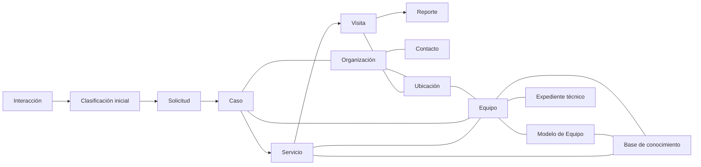

# Modelo de Dominio de Ocre OS

**Estado:** Borrador  
**Versión:** 0.1

## 1. Propósito

Este documento traduce el modelo operativo, el glosario, el flujo y las reglas de negocio de Ocre OS a un **modelo conceptual de información**.

Su objetivo es identificar:

- qué conceptos necesitan identidad propia a lo largo del tiempo;
- cuáles son eventos o registros históricos;
- cuáles son roles o clasificaciones;
- cuáles son relaciones entre conceptos;
- qué información debe mantenerse separada aunque aparezca junta en una pantalla;
- y qué decisiones siguen pendientes antes de diseñar la base de datos.

Este documento **no define todavía tablas SQL, nombres de columnas, APIs ni pantallas**.

---

## 2. Principios del modelo

### 2.1 El modelo representa el negocio, no la interfaz

Que dos datos aparezcan juntos en una pantalla no significa que deban pertenecer al mismo objeto técnico.

Del mismo modo, que dos conceptos tengan pantallas diferentes no significa que necesariamente deban ser entidades independientes.

### 2.2 Identidad antes que formulario

Un concepto merece identidad propia cuando Ocre necesita poder reconocerlo como el mismo elemento a través del tiempo, aunque cambien sus atributos o relaciones.

Ejemplos:

- una Organización sigue siendo la misma aunque cambie de domicilio;
- un Equipo sigue siendo el mismo aunque cambie de Ubicación;
- un Caso sigue siendo el mismo aunque se cierre y posteriormente se reabra.

### 2.3 Los roles no deben duplicar entidades

Cliente, prospecto, fabricante, distribuidor y proveedor describen principalmente **relaciones o roles**.

Una misma Organización podría ser simultáneamente proveedor y cliente de Ocre.

No deben crearse copias de la misma Organización únicamente porque cambie el rol que desempeña.

### 2.4 El historial forma parte del dominio

Cuando un cambio sea relevante para diagnóstico, responsabilidad, seguimiento o auditoría, el modelo debe poder conservar su dimensión temporal.

Ejemplos:

- cambios de Ubicación de un Equipo;
- operadores a lo largo del tiempo;
- modificaciones de configuración;
- cambios de estado de un Caso;
- instalación y retiro de componentes;
- relación de una persona con una Organización.

### 2.5 La información incompleta es válida

El modelo debe permitir registrar la realidad aun cuando todavía falten datos.

No se deben inventar referencias únicamente para satisfacer restricciones del sistema.

---

# 3. Tipos conceptuales utilizados

Para evitar convertir prematuramente cada palabra del glosario en una tabla, este documento utiliza las siguientes categorías.

## 3.1 Entidad

Concepto con identidad propia y continuidad histórica.

## 3.2 Registro o evento

Hecho ocurrido en un momento determinado que debe conservarse para reconstruir el historial.

## 3.3 Rol

Función que una Entidad desempeña dentro de un contexto.

## 3.4 Clasificación o estado

Condición que describe temporalmente a otro elemento, pero que no necesariamente necesita identidad propia.

## 3.5 Relación con atributos

Vínculo entre Entidades que contiene información propia, por ejemplo función, fecha de inicio o vigencia.

## 3.6 Agregado o vista conceptual

Conjunto de información que el usuario percibe como una unidad, aunque internamente pueda estar compuesto por múltiples Entidades y registros.

---

# 4. Mapa general del dominio

Este diagrama expresa relaciones conceptuales y no cardinalidades definitivas.

---

# 5. Personas, Organizaciones y acceso

## 5.1 Contacto

**Tipo conceptual:** Entidad.

Representa una persona identificada sobre la cual Ocre necesita conservar continuidad.

Puede participar como:

- solicitante;
- propietario;
- operador;
- comprador;
- supervisor;
- responsable administrativo;
- responsable de pagos;
- responsable de facturación;
- contacto técnico;
- u otro rol.

Una persona no se duplica por desempeñar diferentes funciones.

### Relaciones principales

- puede relacionarse con cero, una o varias Organizaciones;
- puede originar múltiples Interacciones;
- puede realizar Solicitudes;
- puede participar en Citas, Visitas y aprobaciones;
- puede estar relacionado con uno o varios Equipos como operador u otro rol.

---

## 5.2 Organización

**Tipo conceptual:** Entidad.

Representa una empresa u otra entidad organizada con la cual Ocre necesita mantener una relación persistente.

### Roles posibles

Una Organización puede desempeñar uno o varios roles simultáneos:

- prospecto;
- cliente;
- fabricante;
- distribuidor;
- proveedor;
- taller colaborador;
- tercero de maquila;
- u otro rol futuro.

**Decisión de diseño:** estos roles no crearán Organizaciones duplicadas.

### Relaciones principales

- tiene cero o varias Ubicaciones;
- se relaciona con múltiples Contactos;
- puede ser propietaria, responsable, fabricante, distribuidora o proveedora de Equipos;
- puede originar Solicitudes y Casos;
- puede tener información fiscal y usuarios autorizados para el portal.

---

## 5.3 Relación Contacto–Organización

**Tipo conceptual:** Relación con atributos.

Es necesaria porque una misma persona puede estar relacionada con varias Organizaciones y desempeñar diferentes funciones en cada una.

Debe poder expresar, cuando aplique:

- función o funciones;
- área;
- vigencia;
- si es contacto principal;
- autorización para solicitar Servicios;
- autorización administrativa;
- observaciones.

---

## 5.4 Perfil fiscal

**Tipo conceptual:** componente dependiente de Contacto u Organización; entidad exacta pendiente de implementación.

Los datos fiscales deben formar parte del expediente del cliente, pero no conviene mezclarlos conceptualmente con el nombre comercial o los datos operativos generales.

Una Organización podría requerir más de una identidad fiscal a lo largo del tiempo o en diferentes operaciones.

El modelo debe poder conservar, según corresponda:

- razón social;
- RFC u otro identificador fiscal;
- régimen;
- domicilio fiscal;
- uso o condiciones requeridas;
- correo de facturación;
- documentos fiscales;
- vigencia.

**Importante:** separar el Perfil fiscal en el modelo no significa crear un módulo independiente para el usuario. Puede mostrarse dentro del expediente del cliente.

---

## 5.5 Usuario de la plataforma

**Tipo conceptual:** Entidad de acceso, separada del Contacto.

No toda persona registrada en Ocre OS necesita una cuenta de acceso y una cuenta no debe confundirse con la persona real.

El Usuario deberá poder vincularse con un Contacto y recibir permisos sobre una o varias Organizaciones.

Esto permitirá que una empresa cliente tenga múltiples usuarios con diferentes niveles de acceso.

**Pendiente:** definir posteriormente roles y permisos de seguridad.

---

# 6. Ubicaciones y activos técnicos

## 6.1 Ubicación

**Tipo conceptual:** Entidad.

Representa una instalación física relevante.

Puede corresponder a una planta, taller, almacén, oficina, obra, domicilio u otro lugar.

### Relaciones principales

- pertenece o está asociada a una Organización;
- puede contener múltiples Equipos;
- puede ser destino de múltiples Visitas;
- conserva información operativa y técnica del entorno.

El modelo debe permitir que un Equipo cambie de Ubicación conservando su historial.

---

## 6.2 Equipo

**Tipo conceptual:** Entidad central del dominio técnico.

Representa un activo físico individual identificable.

Cada Equipo debe adquirir un identificador interno único de Ocre OS independiente de:

- cliente actual;
- Ubicación actual;
- operador;
- número de serie del fabricante.

### Relaciones principales

Un Equipo puede:

- estar asociado a una Organización responsable o propietaria;
- encontrarse en una Ubicación determinada;
- corresponder a un Modelo de Equipo;
- participar en cero o múltiples Casos;
- recibir múltiples Servicios y Visitas;
- tener operadores a lo largo del tiempo;
- utilizar componentes y configuraciones;
- relacionarse con otros Equipos;
- acumular un Expediente técnico.

### Regla importante

Un Caso puede existir sin Equipo asociado cuando la necesidad corresponda, por ejemplo, a infraestructura, instalación eléctrica, consultoría o un proceso productivo general.

Por lo tanto, **Equipo no debe ser una referencia obligatoria para crear un Caso**.

---

## 6.3 Propiedad o responsabilidad sobre un Equipo

**Tipo conceptual:** Relación con atributos.

No conviene guardar únicamente `cliente_actual` dentro del Equipo porque su propiedad o responsabilidad puede cambiar.

La relación debe poder conservar:

- Organización;
- tipo de relación: propietario, responsable, arrendatario, usuario, otro;
- fecha de inicio;
- fecha de término;
- observaciones.

---

## 6.4 Historial de Ubicación del Equipo

**Tipo conceptual:** Relación temporal.

Debe permitir responder:

- dónde está actualmente el Equipo;
- dónde estuvo anteriormente;
- durante qué periodo;
- y en qué contexto ocurrió el movimiento.

---

## 6.5 Modelo de Equipo

**Tipo conceptual:** Entidad de referencia técnica.

Representa conocimiento compartido por múltiples Equipos físicos del mismo modelo o familia.

Debe evitarse copiar manuales, especificaciones y procedimientos comunes dentro de cada Equipo individual.

### Relación

Un Modelo de Equipo puede corresponder a múltiples Equipos físicos.

---

## 6.6 Expediente técnico

**Tipo conceptual:** Agregado o vista conceptual centrada en un Equipo.

El Expediente técnico **no se considera por ahora una Entidad independiente**.

Representa la vista acumulada de todo lo conocido sobre un Equipo mediante sus relaciones con:

- identificación;
- Modelo;
- componentes;
- configuraciones;
- operadores;
- Casos;
- Servicios;
- Visitas;
- Reportes;
- Evidencias;
- documentos;
- relaciones con otros Equipos;
- historial de Ubicaciones;
- y conocimiento específico.

Esta decisión evita crear un segundo contenedor que duplique la identidad del Equipo.

---

## 6.7 Relación entre Equipos

**Tipo conceptual:** Relación con atributos.

Debe soportar relaciones dirigidas y no dirigidas.

Ejemplos:

- alimenta a;
- recibe de;
- intercambia información con;
- depende de;
- comparte tecnología con;
- es alternativo a;
- es compatible con.

Puede relacionar Equipos de diferentes Organizaciones cuando exista una razón válida, por ejemplo procesos de maquila o producción externa.

---

# 7. Comunicación y entrada de trabajo

## 7.1 Interacción

**Tipo conceptual:** Registro o evento con identidad persistente.

Toda comunicación relevante genera una Interacción.

La Interacción debe sobrevivir a su clasificación posterior y puede relacionarse con múltiples elementos de contexto.

### Puede relacionarse con

- Contacto;
- Organización;
- Solicitud;
- Caso;
- Cita;
- Servicio;
- otros registros futuros.

Una Interacción puede existir inicialmente sin ninguna de estas relaciones.

---

## 7.2 Contacto 0

**Tipo conceptual:** Clasificación provisional.

**No debe modelarse inicialmente como una Entidad independiente.**

Contacto 0 describe una Interacción cuyo contexto todavía no ha sido resuelto.

Cuando se clasifica la Interacción, C0 deja de aplicar, pero la Interacción permanece.

---

## 7.3 Solicitud

**Tipo conceptual:** Entidad.

Representa lo que una persona u Organización está pidiendo a Ocre.

Debe conservar la expresión original aun cuando posteriormente cambie la interpretación técnica.

### Relaciones

Una Solicitud puede relacionarse con:

- Contacto solicitante;
- Organización;
- Ubicación;
- cero o varios Equipos;
- Interacciones;
- cero, uno o varios Casos.

### Decisión importante

No se fuerza una relación estricta uno-a-uno entre Solicitud y Caso.

Una Solicitud compleja puede necesitar separarse en varios Casos y diferentes Solicitudes relacionadas podrían posteriormente formar parte de una misma continuidad de atención.

La implementación exacta de esta flexibilidad se definirá antes del esquema físico.

---

# 8. Caso y ejecución operativa

## 8.1 Caso

**Tipo conceptual:** Entidad de continuidad operativa.

Es el principal contenedor de seguimiento de una necesidad que requiere atención estructurada.

Un Caso puede existir:

- sin Equipo;
- con un Equipo;
- con varios Equipos;
- asociado a infraestructura o proceso productivo.

### Puede relacionarse con

- una o varias Solicitudes;
- Organización;
- Ubicación;
- Equipos afectados;
- Interacciones;
- Servicios;
- Citas;
- Visitas;
- Cotizaciones;
- Pagos;
- Pendientes;
- Reportes;
- otros Casos relacionados.

### Relaciones entre Casos

Debe ser posible representar, al menos:

- continuación de;
- originado durante evaluación de;
- reincidencia relacionada con;
- independiente pero descubierto durante;
- bloquea a;
- depende de.

Esto soporta la lógica de reincidencias sin destruir la trazabilidad.

---

## 8.2 Estado del Caso

**Tipo conceptual:** Estado, no Entidad.

Los estados preliminares se mantienen en `02-flujo-operativo.md`.

El historial de cambios de estado sí debe conservarse como eventos trazables.

---

## 8.3 Servicio

**Tipo conceptual:** Entidad.

Representa un trabajo profesional concreto que Ocre se compromete a ejecutar o ejecuta dentro de un Caso.

Ejemplos:

- Diagnóstico General Inicial;
- diagnóstico específico;
- mantenimiento;
- reparación;
- calibración;
- instalación;
- modificación;
- capacitación;
- consultoría.

### Importante

Diagnóstico General Inicial es inicialmente un **tipo de Servicio**, no una Entidad paralela.

Un Caso puede contener múltiples Servicios.

---

## 8.4 Cita

**Tipo conceptual:** Entidad o evento programado.

Representa un compromiso de fecha y horario.

Puede corresponder a:

- llamada;
- reunión;
- Visita presencial;
- diagnóstico remoto;
- seguimiento;
- capacitación.

La Cita debe poder sincronizarse posteriormente con Google Calendar sin que Google Calendar se convierta en la fuente primaria del Caso.

---

## 8.5 Visita

**Tipo conceptual:** Entidad de ejecución.

Representa una sesión concreta de trabajo presencial o remoto.

### Relación Servicio–Visita

No se fuerza una relación uno-a-uno.

- un Servicio puede requerir múltiples Visitas;
- una Visita puede ejecutar actividades correspondientes a más de un Servicio del mismo contexto operativo.

La relación deberá permitir identificar qué parte de cada Servicio fue trabajada durante cada Visita.

---

## 8.6 Pendiente

**Tipo conceptual:** Entidad de seguimiento.

Representa una acción futura que no debe depender de memoria personal.

Debe poder relacionarse con diferentes contextos, por ejemplo:

- Caso;
- Servicio;
- Visita;
- Equipo;
- Cotización;
- Solicitud de facturación;
- otro proceso.

### Debe aspirar a conservar

- descripción;
- responsable;
- prioridad;
- fecha objetivo o condición de reactivación;
- estado;
- origen.

---

# 9. Diagnóstico técnico

El diagnóstico merece una estructura propia, pero todavía no se fija su esquema físico.

## 9.1 Diagnóstico

**Tipo conceptual:** Entidad o subagregado dentro del Servicio; decisión física pendiente.

Debe permitir preservar el razonamiento técnico y no únicamente la conclusión final.

### Componentes conceptuales

- Síntoma;
- Hallazgo;
- Hipótesis;
- Prueba;
- Evidencia;
- Causa;
- Causa raíz;
- Intervención;
- Recomendación.

---

## 9.2 Síntoma

**Tipo conceptual:** Registro estructurado.

Puede ser:

- reportado por una persona;
- observado por un técnico;
- detectado por una medición o sistema.

Debe conservar fuente y momento cuando sean relevantes.

---

## 9.3 Hallazgo

**Tipo conceptual:** Registro estructurado.

Puede existir sin ser la causa de la Solicitud investigada.

Esto permite documentar problemas encontrados durante un Servicio sin alterar artificialmente el diagnóstico principal.

---

## 9.4 Hipótesis

**Tipo conceptual:** Registro con ciclo de vida.

Debe poder cambiar de estado, por ejemplo:

- propuesta;
- en evaluación;
- descartada;
- respaldada por evidencia;
- confirmada.

Los nombres definitivos se validarán posteriormente.

---

## 9.5 Prueba y Evidencia

**Tipo conceptual:** registros relacionados pero diferentes.

- **Prueba:** acción realizada deliberadamente para comprobar algo.
- **Evidencia:** información resultante o disponible que respalda una conclusión.

Una Prueba puede generar múltiples Evidencias y una Evidencia puede utilizarse para evaluar múltiples Hipótesis.

---

## 9.6 Intervención

**Tipo conceptual:** Registro técnico con trazabilidad.

Debe indicar, cuando aplique:

- qué se modificó;
- motivo;
- responsable;
- fecha;
- si es temporal o definitiva;
- componentes implicados;
- configuración anterior y posterior;
- limitaciones o riesgos.

---

# 10. Reportes y documentos comerciales

## 10.1 Reporte de servicio

**Tipo conceptual:** Entidad documental versionable.

Un Reporte debe pertenecer a un contexto principal, normalmente un Caso, y puede tomar información de:

- una o varias Visitas;
- uno o varios Servicios;
- Diagnósticos;
- Evidencias;
- Intervenciones;
- Pendientes;
- Recomendaciones.

### Recomendación de diseño pendiente de validación

Una vez emitido formalmente al cliente, conviene que el contenido de esa versión quede inmutable y cualquier corrección genere una versión posterior en lugar de reescribir silenciosamente el documento enviado.

---

## 10.2 Cotización

**Tipo conceptual:** Entidad documental versionable.

Puede estar vinculada con un Caso y contener propuestas de:

- Servicios;
- refacciones;
- materiales;
- condiciones;
- anticipos;
- tiempos;
- alcance.

Una Cotización puede tener revisiones sin que deba perderse el historial de propuestas anteriores.

---

## 10.3 Pago

**Tipo conceptual:** Registro financiero.

Debe mantenerse separado de:

- Cotización;
- factura fiscal;
- Solicitud de facturación.

Un Pago puede aplicarse total o parcialmente a obligaciones relacionadas con uno o varios conceptos.

La asignación exacta se definirá cuando se modele el ciclo de cobro.

---

## 10.4 Solicitud de facturación

**Tipo conceptual:** Entidad de flujo administrativo.

Debe reunir información suficiente para solicitar externamente una factura y controlar su estado hasta recibir el resultado.

Puede relacionarse con:

- Organización o Contacto fiscal;
- Perfil fiscal;
- Pago;
- Caso;
- documentos fiscales;
- responsable interno o externo.

---

# 11. Refacciones, componentes e inventario

Esta parte requiere una distinción importante para soportar las piezas reparadas y de emergencia descritas en el modelo operativo.

## 11.1 Referencia de componente o refacción

**Tipo conceptual:** Entidad de catálogo técnico.

Representa qué tipo de pieza es.

Puede contener:

- fabricante;
- número de parte;
- familia;
- especificaciones;
- compatibilidades;
- aplicaciones conocidas;
- estrategia de abastecimiento.

---

## 11.2 Unidad física de inventario

**Tipo conceptual:** Entidad física cuando se requiere trazabilidad individual.

Representa una pieza concreta que Ocre posee o utiliza.

Esta separación es necesaria porque dos unidades del mismo número de parte pueden tener condiciones diferentes.

Ejemplo:

- unidad A: nueva, apta para uso permanente;
- unidad B: recuperada, apta únicamente para emergencia;
- unidad C: retirada, pendiente de reparación.

No todas las piezas económicas necesitarán seguimiento individual. La implementación deberá permitir trabajar también por cantidades o lotes cuando no exista valor en serializar cada unidad.

---

## 11.3 Movimiento de inventario

**Tipo conceptual:** Evento.

Debe permitir reconstruir, cuando sea relevante:

- compra;
- ingreso;
- reserva para Caso;
- instalación;
- retiro;
- devolución;
- reparación;
- reclasificación;
- descarte.

---

# 12. Conocimiento técnico

## 12.1 Base de conocimiento

**Tipo conceptual:** Agregado de conocimiento reutilizable.

No debe confundirse con el Expediente técnico individual.

El conocimiento puede asociarse a:

- fabricante;
- Modelo de Equipo;
- tecnología;
- componente;
- síntoma;
- procedimiento;
- configuración;
- diagnóstico;
- solución;
- herramienta.

---

## 12.2 Elemento de conocimiento

**Tipo conceptual:** Entidad candidata.

Puede representar:

- manual;
- boletín técnico;
- procedimiento;
- nota validada;
- archivo de configuración;
- software o firmware;
- lista de partes;
- capacitación;
- solución comprobada;
- advertencia técnica.

Debe conservar procedencia, contexto y nivel de confianza cuando corresponda.

---

## 12.3 Configuración y respaldo

**Tipo conceptual:** Registro versionado relacionado con un Equipo, Modelo o software.

Debe permitir saber:

- de qué Equipo o sistema proviene;
- cuándo se obtuvo;
- bajo qué condición se consideró válida;
- versión;
- archivo o parámetros asociados;
- procedimiento de restauración.

---

# 13. Relaciones conceptuales principales

| Origen | Relación | Destino | Observación |
|---|---|---|---|
| Organización | tiene | Ubicación | 1 a muchas |
| Organización | se relaciona mediante roles con | Contacto | muchos a muchos |
| Organización | puede desempeñar rol | Cliente / Prospecto / Fabricante / Distribuidor / Proveedor | rol, no copia de entidad |
| Organización | tiene relación temporal con | Equipo | propiedad, uso o responsabilidad |
| Ubicación | aloja temporalmente | Equipo | conserva historial |
| Modelo de Equipo | describe | Equipo | uno a muchos |
| Equipo | se relaciona con | Equipo | relación tipificada |
| Contacto | origina | Interacción | una a muchas |
| Interacción | puede originar o vincularse con | Solicitud | opcional |
| Solicitud | puede derivar en | Caso | flexible, no uno-a-uno forzado |
| Caso | contiene | Servicio | uno a muchos |
| Caso | puede afectar | Equipo | cero a muchos |
| Servicio | se ejecuta mediante | Visita | muchos a muchos conceptualmente |
| Visita | ocurre en | Ubicación | opcional para remoto |
| Caso | genera | Reporte | uno a muchos |
| Equipo | acumula | Expediente técnico | agregado conceptual |
| Equipo / Modelo / Servicio | aportan a | Base de conocimiento | conocimiento reutilizable |
| Caso | genera | Pendiente | cero a muchos |
| Caso | puede generar | Cotización | cero a muchas |
| Pago | puede relacionarse con | Caso / Cotización / conceptos cobrados | asignación pendiente de detalle |

---

# 14. Agregados conceptuales para la experiencia de usuario

Aunque el modelo interno separe conceptos, la interfaz debe presentarlos de manera coherente.

## 14.1 Expediente de Organización

Puede reunir visualmente:

- datos generales;
- Contactos;
- Ubicaciones;
- Equipos;
- información fiscal;
- Solicitudes;
- Casos;
- Reportes;
- pagos y facturación.

Esto no significa almacenar toda la información en una sola entidad.

## 14.2 Expediente de Equipo

Puede reunir visualmente:

- identidad;
- Modelo;
- historial de Ubicación y propiedad;
- componentes;
- configuraciones;
- operador;
- Casos;
- Servicios;
- Reportes;
- documentación;
- relaciones de proceso;
- conocimiento técnico específico.

## 14.3 Vista de Caso

Debe convertirse en una de las vistas operativas principales y reunir:

- Solicitud y necesidad;
- Interacciones;
- Organización y Contactos;
- Equipos o proceso afectado;
- agenda;
- Servicios;
- Visitas;
- Diagnóstico;
- Cotizaciones;
- Pagos;
- Reportes;
- Pendientes;
- decisiones y trazabilidad.

---

# 15. Decisiones que se consideran suficientemente sólidas

A partir de los documentos 00–03, se consideran aceptadas provisionalmente las siguientes decisiones conceptuales:

1. **Interacción es el registro de comunicación; Contacto 0 es una clasificación provisional.**
2. **Contacto 0 no debe ser una Entidad independiente en el modelo inicial.**
3. **Organización y Contacto son Entidades diferentes.**
4. **Cliente, prospecto, fabricante, distribuidor y proveedor se modelarán preferentemente como roles.**
5. **Ubicación es diferente de Organización.**
6. **Equipo posee identidad propia independiente del cliente o Ubicación actuales.**
7. **El Expediente técnico se construye alrededor del Equipo y no necesita inicialmente identidad separada.**
8. **Solicitud y Caso son conceptos diferentes.**
9. **Caso no exige que exista un Equipo.**
10. **Servicio y Visita son conceptos diferentes.**
11. **Diagnóstico General Inicial es inicialmente un tipo de Servicio.**
12. **El historial de reincidencias debe preservarse mediante relaciones y trazabilidad entre Casos.**
13. **Reporte, Cotización, Pago y Solicitud de facturación son conceptos diferentes.**
14. **La base de conocimiento es diferente del expediente de una máquina específica.**
15. **Una referencia de refacción y una unidad física concreta pueden necesitar representaciones diferentes.**

---

# 16. Decisiones pendientes antes del esquema de base de datos

Las siguientes preguntas deben resolverse mediante casos reales antes de diseñar las tablas definitivas:

1. ¿Cuándo varias Solicitudes se consolidan en un mismo Caso?
2. ¿Cuándo una Solicitud debe dividirse en varios Casos?
3. ¿Puede un Servicio pertenecer a más de un Caso o siempre tendrá un Caso principal?
4. ¿En qué circunstancias una Visita puede abarcar Servicios de Casos diferentes?
5. ¿Cuál es el ciclo de vida completo de una Cotización y sus revisiones?
6. ¿Cómo se representa el cobro: cargos, conceptos, anticipos, saldo y asignación de Pagos?
7. ¿Cuántos Perfiles fiscales puede tener una Organización o persona y cómo se selecciona el correcto por operación?
8. ¿Qué niveles de acceso necesitarán los usuarios del portal del cliente?
9. ¿Qué información de Diagnóstico debe ser estructurada desde la primera versión y qué puede comenzar como texto libre?
10. ¿Qué piezas de inventario requieren trazabilidad individual y cuáles pueden manejarse únicamente por cantidad?
11. ¿Cómo se representa formalmente un proceso productivo más allá de las relaciones simples entre Equipos?
12. ¿Cómo se versionan y aprueban Reportes emitidos al cliente?

Estas preguntas no bloquean el desarrollo completo del proyecto, pero sí deben resolverse antes de convertir cada área correspondiente en un esquema físico estable.

---

# 17. Próximo paso

El siguiente documento deberá convertir este modelo conceptual en una **primera especificación del MVP operativo**.

El MVP debe priorizar el problema económico inmediato de Ocre:

- registrar una atención;
- identificar o crear Organización y Contacto;
- registrar Equipo cuando corresponda;
- abrir y dar seguimiento a un Caso;
- ejecutar un Servicio y una Visita;
- capturar evidencia y actividades desde campo;
- generar un Reporte profesional;
- dejar Pendientes visibles;
- y preparar el seguimiento de cobro.

La primera versión no necesita implementar todavía toda la inteligencia diagnóstica ni toda la base de conocimiento para comenzar a generar valor.
