# Modelo de Datos V0 de Ocre OS

**Estado:** Borrador implementable  
**Versión:** 0.1

## 1. Propósito

Este documento convierte el Modelo de Dominio y el MVP Operativo en una primera estructura persistente para el **corte vertical V0** de Ocre OS.

El objetivo no es diseñar toda la base de datos futura. El objetivo es definir una estructura suficientemente sólida para comenzar a programar el flujo que hoy genera valor económico:

**Organización → Contacto → Equipo → Solicitud → Caso → Servicio → Visita → Reporte → Cobro pendiente**

con la Interacción mínima necesaria para conservar el origen de cada atención.

Este modelo debe permitir comenzar a operar sin cerrar el camino a:

- reincidencias;
- múltiples Equipos por Caso;
- múltiples Servicios por Caso;
- múltiples Visitas por Servicio;
- historial técnico;
- Reportes versionados;
- portal del cliente;
- facturación externa;
- base de conocimiento;
- inventario;
- e inteligencia diagnóstica futura.

---

# 2. Decisiones estructurales V0

## 2.1 Base relacional

La implementación V0 se diseñará para PostgreSQL.

Las relaciones principales del negocio se representarán mediante relaciones explícitas y no mediante documentos JSON gigantes.

`JSONB` podrá utilizarse únicamente para información técnica flexible que todavía no justifique una estructura rígida.

## 2.2 Identificadores

Las entidades persistentes utilizarán un identificador interno UUID.

Cuando un elemento necesite ser reconocido por personas, tendrá además un código legible independiente del UUID.

Ejemplos futuros:

- Equipo: `EQ-000123`
- Caso: `CAS-000456`
- Reporte: `REP-000789`

El código humano no será la llave primaria.

## 2.3 Tiempo

Las fechas de sistema se almacenarán con zona horaria (`timestamptz`).

La aplicación mostrará las fechas utilizando la zona horaria operativa correspondiente.

## 2.4 Conservación

Los objetos históricos del negocio no deben desaparecer mediante borrado físico ordinario.

Cuando sea necesario retirar un elemento de operación se utilizará estado de archivo, cancelación o fecha de baja.

Los eventos inmutables, como Interacciones y versiones emitidas de Reportes, no deberán sobrescribirse silenciosamente.

## 2.5 Trazabilidad común

Las entidades modificables deberán conservar, cuando aplique:

- `created_at`;
- `updated_at`;
- `created_by`;
- `updated_by`.

No se implementará todavía un sistema universal de event sourcing.

Los cambios cuyo historial sea parte del negocio tendrán registros temporales específicos.

## 2.6 Lenguaje del dominio

Los nombres conceptuales de Ocre OS se mantendrán en español.

Los nombres físicos sugeridos para base de datos serán `snake_case`, en español y sin acentos, para conservar el lenguaje ubicuo del dominio.

Ejemplo:

`organizacion`, `equipo`, `caso`, `visita`, `reporte_version`.

---

# 3. Diagrama relacional V0

```mermaid
erDiagram
    USUARIO ||--o{ INTERACCION : registra
    USUARIO ||--o{ CASO : responsable
    USUARIO ||--o{ VISITA : participa

    ORGANIZACION ||--o{ CONTACTO_ORGANIZACION : relaciona
    CONTACTO ||--o{ CONTACTO_ORGANIZACION : pertenece
    CONTACTO_ORGANIZACION ||--o{ CONTACTO_ORGANIZACION_ROL : tiene

    ORGANIZACION ||--o{ PERFIL_FISCAL : posee
    ORGANIZACION ||--o{ UBICACION : tiene

    EQUIPO ||--o{ EQUIPO_ORGANIZACION : relacion
    ORGANIZACION ||--o{ EQUIPO_ORGANIZACION : relacion
    EQUIPO ||--o{ EQUIPO_UBICACION : historial
    UBICACION ||--o{ EQUIPO_UBICACION : historial

    CONTACTO ||--o{ INTERACCION : origina
    ORGANIZACION ||--o{ INTERACCION : contexto

    CONTACTO ||--o{ SOLICITUD : solicita
    ORGANIZACION ||--o{ SOLICITUD : recibe
    SOLICITUD ||--o{ SOLICITUD_EQUIPO : menciona
    EQUIPO ||--o{ SOLICITUD_EQUIPO : relacionado

    SOLICITUD ||--o{ CASO_SOLICITUD : deriva
    CASO ||--o{ CASO_SOLICITUD : atiende
    CASO ||--o{ CASO_EQUIPO : afecta
    EQUIPO ||--o{ CASO_EQUIPO : afectado
    CASO ||--o{ CASO_RELACION : origen
    CASO ||--o{ CASO_RELACION : destino
    CASO ||--o{ CASO_ESTADO_HISTORIAL : cambia

    CASO ||--o{ SERVICIO : contiene
    SERVICIO ||--o{ SERVICIO_EQUIPO : trabaja
    EQUIPO ||--o{ SERVICIO_EQUIPO : recibe

    CASO ||--o{ VISITA : contextualiza
    UBICACION ||--o{ VISITA : ocurre
    SERVICIO ||--o{ SERVICIO_VISITA : ejecuta
    VISITA ||--o{ SERVICIO_VISITA : incluye

    VISITA ||--o{ REGISTRO_TECNICO : captura
    VISITA ||--o{ EVIDENCIA : genera
    ARCHIVO ||--o| EVIDENCIA : contiene
    REGISTRO_TECNICO ||--o{ REGISTRO_EVIDENCIA : respalda
    EVIDENCIA ||--o{ REGISTRO_EVIDENCIA : respalda

    CASO ||--o{ REPORTE : genera
    REPORTE ||--o{ REPORTE_VERSION : versiona
    ARCHIVO ||--o| REPORTE_VERSION : pdf

    CASO ||--o{ PENDIENTE : genera
    SERVICIO ||--o{ PENDIENTE : puede_generar
    VISITA ||--o{ PENDIENTE : puede_generar

    CASO ||--o{ COBRO : genera
    SERVICIO ||--o{ COBRO : puede_originar
```



El diagrama representa el V0. Algunas relaciones se ampliarán posteriormente.

---

# 4. Convenciones de campos

Los siguientes nombres se utilizarán de forma consistente cuando correspondan:

| Campo | Propósito |
|---|---|
| `id` | UUID interno |
| `codigo` | identificador humano cuando sea necesario |
| `estado` | código estable de estado de negocio |
| `created_at` | creación |
| `updated_at` | última modificación |
| `created_by` | Usuario creador |
| `updated_by` | Usuario que modificó |
| `archived_at` | retiro de operación sin borrar historial |

Los estados se almacenarán inicialmente mediante códigos de texto controlados por la aplicación.

Se evita PostgreSQL `ENUM` en esta fase porque el modelo de negocio todavía está evolucionando.

---

# 5. Identidad y usuarios

## 5.1 `usuario`

Representa una cuenta capaz de acceder a Ocre OS.

### Campos V0

- `id` UUID PK
- `email` texto único
- `password_hash` texto, si la autenticación inicial es local
- `nombre_mostrado` texto
- `activo` booleano
- `contacto_id` UUID nullable
- `ultimo_acceso_at` timestamptz nullable
- campos de trazabilidad

### Nota

Usuario y Contacto permanecen separados. Una persona puede existir como Contacto sin tener acceso a la plataforma.

---

# 6. Organizaciones, personas y datos fiscales

## 6.1 `organizacion`

Representa una empresa u organización identificable.

### Campos V0

- `id` UUID PK
- `nombre_comercial` texto
- `nombre_legal` texto nullable
- `telefono_principal` texto nullable
- `email_general` texto nullable
- `sitio_web` texto nullable
- `estado_relacion` texto nullable
- `notas` texto nullable
- campos de trazabilidad
- `archived_at` nullable

### Restricción

`nombre_comercial` no será único globalmente. Dos organizaciones pueden compartir nombres similares.

---

## 6.2 `organizacion_rol`

Permite que una misma Organización tenga varios roles sin duplicarse.

### Campos

- `id` UUID PK
- `organizacion_id` FK
- `rol` texto
- `desde` timestamptz nullable
- `hasta` timestamptz nullable
- `notas` texto nullable

### Roles iniciales

- `prospecto`
- `cliente`
- `fabricante`
- `distribuidor`
- `proveedor`
- `taller_colaborador`
- `tercero_maquila`

La lista podrá crecer.

---

## 6.3 `contacto`

Representa una persona identificada.

### Campos V0

- `id` UUID PK
- `nombre` texto
- `apellidos` texto nullable
- `telefono_principal` texto nullable
- `whatsapp` texto nullable
- `email_principal` texto nullable
- `notas` texto nullable
- campos de trazabilidad
- `archived_at` nullable

### Nota

Los teléfonos y correos adicionales podrán normalizarse posteriormente si la operación demuestra que es necesario.

---

## 6.4 `contacto_organizacion`

Relación temporal entre una persona y una Organización.

### Campos

- `id` UUID PK
- `contacto_id` FK
- `organizacion_id` FK
- `area` texto nullable
- `cargo` texto nullable
- `es_contacto_principal` booleano
- `puede_solicitar_servicio` booleano
- `puede_autorizar` booleano
- `desde` timestamptz nullable
- `hasta` timestamptz nullable
- `notas` texto nullable

---

## 6.5 `contacto_organizacion_rol`

Permite múltiples funciones simultáneas sin duplicar Contactos.

### Campos

- `id` UUID PK
- `contacto_organizacion_id` FK
- `rol` texto

### Roles iniciales sugeridos

- `propietario`
- `operador`
- `compras`
- `supervisor`
- `mantenimiento`
- `administracion`
- `pagos`
- `facturacion`
- `contacto_tecnico`

---

## 6.6 `perfil_fiscal`

Los datos fiscales aparecen dentro del expediente del cliente, pero se conservan separados de la identidad operativa de la Organización.

### Campos V0

- `id` UUID PK
- `organizacion_id` UUID FK
- `razon_social` texto
- `rfc` texto
- `regimen_fiscal` texto nullable
- `codigo_postal_fiscal` texto nullable
- `email_facturacion` texto nullable
- `uso_cfdi_default` texto nullable
- `es_predeterminado` booleano
- `vigente_desde` date nullable
- `vigente_hasta` date nullable
- `notas` texto nullable
- campos de trazabilidad

### Decisión V0

Una Organización puede tener más de un Perfil fiscal. Solo uno puede ser predeterminado por vez.

La facturación de personas físicas sin Organización se resolverá en una iteración posterior si aparece un caso operativo real que lo requiera.

---

# 7. Ubicaciones y Equipos

## 7.1 `ubicacion`

### Campos V0

- `id` UUID PK
- `organizacion_id` UUID FK
- `nombre` texto
- `direccion_linea_1` texto nullable
- `direccion_linea_2` texto nullable
- `colonia` texto nullable
- `ciudad` texto nullable
- `estado_region` texto nullable
- `codigo_postal` texto nullable
- `pais` texto default `MX`
- `referencias_acceso` texto nullable
- `horarios` texto nullable
- `observaciones_tecnicas` texto nullable
- campos de trazabilidad
- `archived_at` nullable

---

## 7.2 `equipo`

Representa la identidad persistente de una máquina o activo técnico individual.

### Campos V0

- `id` UUID PK
- `codigo` texto único
- `tipo_familia` texto nullable
- `marca` texto nullable
- `modelo` texto nullable
- `numero_serie` texto nullable
- `descripcion` texto nullable
- `estado_operativo` texto nullable
- `fecha_alta` timestamptz
- `notas` texto nullable
- campos de trazabilidad
- `archived_at` nullable

### Importante

No se guarda `cliente_id` como identidad del Equipo.

La relación con Organizaciones y Ubicaciones se conserva temporalmente en tablas separadas.

---

## 7.3 `equipo_organizacion`

### Campos

- `id` UUID PK
- `equipo_id` FK
- `organizacion_id` FK
- `tipo_relacion` texto
- `desde` timestamptz
- `hasta` timestamptz nullable
- `notas` texto nullable

### Tipos iniciales

- `propietario`
- `responsable`
- `usuario`
- `arrendatario`

---

## 7.4 `equipo_ubicacion`

### Campos

- `id` UUID PK
- `equipo_id` FK
- `ubicacion_id` FK
- `desde` timestamptz
- `hasta` timestamptz nullable
- `motivo_cambio` texto nullable
- `notas` texto nullable

### Regla

Un Equipo no debería tener simultáneamente dos Ubicaciones físicas activas, salvo que posteriormente aparezca un caso de negocio que lo justifique.

---

# 8. Archivos

## 8.1 `archivo`

Representa metadatos de un archivo almacenado fuera de PostgreSQL.

### Campos V0

- `id` UUID PK
- `storage_key` texto único
- `nombre_original` texto
- `mime_type` texto
- `size_bytes` bigint nullable
- `sha256` texto nullable
- `uploaded_by` UUID nullable
- `created_at` timestamptz

### Decisión

La base de datos no almacenará fotografías y PDFs grandes como blobs ordinarios.

El contenido se almacenará en almacenamiento de objetos o sistema compatible y PostgreSQL conservará la referencia.

---

# 9. Interacciones y Solicitudes

## 9.1 `interaccion`

Registro histórico de comunicación.

### Campos V0

- `id` UUID PK
- `ocurrio_at` timestamptz
- `canal` texto
- `direccion` texto: `entrante` o `saliente`
- `identificador_origen` texto nullable
- `resumen` texto
- `contenido` texto nullable
- `contacto_id` UUID nullable
- `organizacion_id` UUID nullable
- `solicitud_id` UUID nullable
- `caso_id` UUID nullable
- `estado_clasificacion` texto
- `registrada_por` UUID nullable
- `created_at` timestamptz

### Estados de clasificación iniciales

- `pendiente` — equivalente operativo a Contacto 0
- `clasificada`
- `sin_accion`

### Importante

Contacto 0 no tiene tabla propia.

---

## 9.2 `solicitud`

### Campos V0

- `id` UUID PK
- `codigo` texto único nullable
- `contacto_solicitante_id` UUID nullable
- `organizacion_id` UUID nullable
- `ubicacion_id` UUID nullable
- `expresion_original` texto
- `necesidad_percibida` texto nullable
- `urgencia` texto nullable
- `estado` texto
- `recibida_at` timestamptz
- campos de trazabilidad

### Regla

Una Solicitud puede existir sin Equipo conocido.

---

## 9.3 `solicitud_equipo`

Relación muchos-a-muchos.

### Campos

- `solicitud_id` FK
- `equipo_id` FK
- `relacion` texto nullable

PK compuesta sugerida: (`solicitud_id`, `equipo_id`).

---

# 10. Casos

## 10.1 `caso`

Principal unidad de continuidad operativa.

### Campos V0

- `id` UUID PK
- `codigo` texto único
- `organizacion_id` UUID nullable
- `ubicacion_id` UUID nullable
- `titulo` texto
- `necesidad_identificada` texto nullable
- `estado` texto
- `prioridad` texto nullable
- `responsable_id` UUID nullable
- `abierto_at` timestamptz
- `cerrado_at` timestamptz nullable
- `motivo_cierre` texto nullable
- campos de trazabilidad

### Estados iniciales

- `nuevo`
- `pendiente_informacion`
- `pendiente_cotizacion`
- `pendiente_anticipo`
- `agendado`
- `en_atencion`
- `esperando_refaccion`
- `esperando_cliente`
- `evaluando_reincidencia`
- `pendiente_validacion`
- `cerrado`
- `cancelado`

---

## 10.2 `caso_solicitud`

No se fuerza uno-a-uno.

### Campos

- `caso_id` FK
- `solicitud_id` FK
- `tipo_relacion` texto nullable

PK compuesta sugerida.

---

## 10.3 `caso_equipo`

### Campos

- `caso_id` FK
- `equipo_id` FK
- `rol` texto nullable
- `es_principal` booleano

Permite Caso sin Equipo y Caso con varios Equipos.

---

## 10.4 `caso_relacion`

Permite preservar reincidencias y bifurcaciones.

### Campos

- `id` UUID PK
- `caso_origen_id` FK
- `caso_destino_id` FK
- `tipo_relacion` texto
- `motivo` texto nullable
- `created_at` timestamptz
- `created_by` UUID nullable

### Tipos iniciales

- `continuacion_de`
- `reincidencia_relacionada`
- `originado_durante_evaluacion_de`
- `independiente_descubierto_durante`
- `bloquea_a`
- `depende_de`

---

## 10.5 `caso_estado_historial`

### Campos

- `id` UUID PK
- `caso_id` FK
- `estado_anterior` texto nullable
- `estado_nuevo` texto
- `motivo` texto nullable
- `interaccion_id` UUID nullable
- `changed_at` timestamptz
- `changed_by` UUID nullable

El estado actual permanece en `caso.estado`; esta tabla conserva cómo se llegó a él.

---

# 11. Servicios y Visitas

## 11.1 `servicio`

### Campos V0

- `id` UUID PK
- `codigo` texto único nullable
- `caso_id` UUID FK
- `tipo` texto
- `titulo` texto
- `objetivo` texto nullable
- `estado` texto
- `responsable_id` UUID nullable
- `iniciado_at` timestamptz nullable
- `concluido_at` timestamptz nullable
- `resultado_resumen` texto nullable
- campos de trazabilidad

### Tipos iniciales

- `diagnostico_general_inicial`
- `diagnostico_especifico`
- `reparacion`
- `mantenimiento_preventivo`
- `mantenimiento_correctivo`
- `calibracion`
- `instalacion`
- `modificacion`
- `capacitacion`
- `consultoria`

---

## 11.2 `servicio_equipo`

### Campos

- `servicio_id` FK
- `equipo_id` FK
- `es_principal` booleano

Permite que un Servicio involucre varios Equipos sin obligar a dividirlo artificialmente.

---

## 11.3 `visita`

Representa una sesión concreta de ejecución presencial o remota.

### Campos V0

- `id` UUID PK
- `codigo` texto único nullable
- `caso_id` UUID FK
- `ubicacion_id` UUID nullable
- `modalidad` texto
- `estado` texto
- `inicio_programado_at` timestamptz nullable
- `fin_programado_at` timestamptz nullable
- `inicio_real_at` timestamptz nullable
- `fin_real_at` timestamptz nullable
- `resumen` texto nullable
- `resultado` texto nullable
- campos de trazabilidad

### Modalidades iniciales

- `presencial`
- `remota`

---

## 11.4 `servicio_visita`

Relación muchos-a-muchos.

### Campos

- `servicio_id` FK
- `visita_id` FK
- `trabajo_realizado` texto nullable

Esto permite que una Visita atienda más de un Servicio del mismo Caso.

---

## 11.5 `visita_tecnico`

Permite más de un técnico por Visita.

### Campos

- `visita_id` FK
- `usuario_id` FK
- `rol` texto nullable

---

# 12. Captura técnica del V0

La primera versión debe preservar estructura suficiente para producir buenos Reportes sin intentar implementar todavía todo el motor de razonamiento.

## 12.1 `registro_tecnico`

Registro tipificado capturado durante una Visita.

### Campos V0

- `id` UUID PK
- `visita_id` UUID FK
- `servicio_id` UUID nullable
- `equipo_id` UUID nullable
- `tipo` texto
- `titulo` texto nullable
- `descripcion` texto
- `estado` texto nullable
- `fuente` texto nullable
- `datos` JSONB nullable
- `orden` integer nullable
- `created_at` timestamptz
- `created_by` UUID nullable
- `updated_at` timestamptz nullable

### Tipos iniciales

- `sintoma`
- `hallazgo`
- `hipotesis`
- `prueba`
- `medicion`
- `diagnostico`
- `causa`
- `causa_raiz`
- `intervencion`
- `recomendacion`
- `actividad`

### Uso de `datos`

`datos` permitirá estructura específica mientras aprendemos qué campos merecen tablas propias.

Ejemplo de medición:

```json
{
  "valor": 219.8,
  "unidad": "V",
  "punto": "L1-L2",
  "instrumento": "multimetro"
}
```

### Regla

Las relaciones críticas no deben esconderse dentro de `datos`.

Caso, Visita, Servicio, Equipo, archivos y responsables continúan utilizando FKs explícitas.

---

# 13. Evidencias

## 13.1 `evidencia`

### Campos V0

- `id` UUID PK
- `visita_id` UUID nullable
- `caso_id` UUID nullable
- `equipo_id` UUID nullable
- `archivo_id` UUID nullable
- `tipo` texto
- `titulo` texto nullable
- `descripcion` texto nullable
- `capturada_at` timestamptz nullable
- `created_at` timestamptz
- `created_by` UUID nullable

### Tipos iniciales

- `fotografia`
- `video`
- `documento`
- `captura_pantalla`
- `archivo_tecnico`
- `otro`

Una Evidencia no debe quedar huérfana de contexto.

---

## 13.2 `registro_evidencia`

Relación entre registros técnicos y Evidencias.

### Campos

- `registro_tecnico_id` FK
- `evidencia_id` FK
- `tipo_relacion` texto nullable

Esto permite que una fotografía respalde múltiples Hallazgos o Hipótesis sin duplicar el archivo.

---

# 14. Reportes

## 14.1 `reporte`

Representa la identidad lógica de un Reporte.

### Campos V0

- `id` UUID PK
- `codigo` texto único
- `caso_id` UUID FK
- `titulo` texto
- `tipo` texto default `servicio`
- `estado` texto
- `created_at` timestamptz
- `created_by` UUID nullable

### Estados sugeridos

- `borrador`
- `listo_revision`
- `emitido`
- `anulado`

---

## 14.2 `reporte_version`

Cada emisión formal conserva una versión inmutable.

### Campos V0

- `id` UUID PK
- `reporte_id` UUID FK
- `numero_version` integer
- `contenido_snapshot` JSONB
- `pdf_archivo_id` UUID nullable
- `generado_at` timestamptz
- `emitido_at` timestamptz nullable
- `emitido_por` UUID nullable
- `nota_version` texto nullable

### Restricciones

- (`reporte_id`, `numero_version`) único.
- Una versión emitida no se modifica.
- Una corrección genera otra versión.

### Decisión

`contenido_snapshot` conserva los datos exactos utilizados para generar el documento, aunque posteriormente cambien el Equipo, Contacto o Caso.

---

# 15. Pendientes

## 15.1 `pendiente`

### Campos V0

- `id` UUID PK
- `titulo` texto
- `descripcion` texto nullable
- `estado` texto
- `prioridad` texto nullable
- `responsable_id` UUID nullable
- `caso_id` UUID nullable
- `servicio_id` UUID nullable
- `visita_id` UUID nullable
- `equipo_id` UUID nullable
- `fecha_objetivo` timestamptz nullable
- `condicion_reactivacion` texto nullable
- `origen` texto nullable
- `completed_at` timestamptz nullable
- campos de trazabilidad

### Estados iniciales

- `pendiente`
- `en_progreso`
- `esperando`
- `completado`
- `cancelado`

### Regla

Por lo menos uno de sus contextos debe ser identificable cuando el Pendiente provenga de una operación registrada.

---

# 16. Control económico mínimo

## 16.1 `cobro`

Representa un importe que Ocre espera cobrar o ha decidido no cobrar, asociado a trabajo realizado o acordado.

No representa todavía un Pago ni una factura fiscal.

### Campos V0

- `id` UUID PK
- `caso_id` UUID FK
- `servicio_id` UUID nullable
- `concepto` texto
- `monto` numeric(14,2)
- `moneda` char(3) default `MXN`
- `tipo` texto
- `estado` texto
- `fecha_acordada` date nullable
- `fecha_vencimiento` date nullable
- `motivo_cortesia` texto nullable
- `notas` texto nullable
- campos de trazabilidad

### Tipos iniciales

- `anticipo`
- `servicio`
- `refaccion`
- `otro`

### Estados iniciales

- `borrador`
- `pendiente`
- `pagado`
- `parcial`
- `cortesia`
- `cancelado`

### Decisión V0

Para obtener valor rápidamente, el estado podrá actualizarse manualmente.

En el siguiente corte se incorporarán `pago` y asignación de Pagos a Cobros, evitando utilizar el campo de estado como sustituto permanente del modelo financiero.

### Consulta crítica

El tablero debe poder responder mediante esta entidad:

> ¿Qué trabajo ya realizamos y todavía está pendiente de cobro?

---

# 17. Relaciones deliberadamente pospuestas

No se implementarán en la primera migración salvo que resulten indispensables durante desarrollo:

- Modelo de Equipo estructurado;
- componentes instalados;
- inventario y movimientos;
- configuración versionada;
- documentos del fabricante;
- base de conocimiento;
- Cotizaciones versionadas completas;
- Pago y distribución de Pagos;
- Solicitud de facturación completa;
- usuarios del portal del cliente;
- permisos por Organización;
- relaciones avanzadas entre Equipos;
- procesos productivos formales.

La estructura V0 no debe impedir añadirlos posteriormente.

---

# 18. Índices mínimos previstos

Sin diseñar todavía la migración SQL exacta, deberán existir índices para los recorridos operativos más frecuentes.

Como mínimo:

- `organizacion(nombre_comercial)`
- `contacto(telefono_principal)`
- `contacto(email_principal)`
- `equipo(codigo)` único
- `equipo(numero_serie)` no único
- `interaccion(ocurrio_at)`
- `interaccion(identificador_origen)`
- `solicitud(organizacion_id, recibida_at)`
- `caso(codigo)` único
- `caso(estado, responsable_id)`
- `caso(organizacion_id, abierto_at)`
- `servicio(caso_id, estado)`
- `visita(caso_id, inicio_programado_at)`
- `registro_tecnico(visita_id, tipo)`
- `evidencia(visita_id)`
- `reporte(codigo)` único
- `pendiente(estado, responsable_id, fecha_objetivo)`
- `cobro(estado, created_at)`

---

# 19. Restricciones de integridad importantes

La primera implementación deberá proteger, al menos, estas condiciones:

1. Un Equipo no puede compartir el mismo `codigo` Ocre OS con otro Equipo.
2. Un Caso no puede compartir el mismo `codigo` con otro Caso.
3. Una versión de Reporte no puede repetirse dentro del mismo Reporte.
4. Un `caso_relacion` no puede relacionar un Caso consigo mismo.
5. `equipo_ubicacion.hasta` no puede ser anterior a `desde`.
6. `equipo_organizacion.hasta` no puede ser anterior a `desde`.
7. Un Cobro no puede tener monto negativo en el V0.
8. Una versión de Reporte emitida se considera inmutable desde la aplicación.
9. Una Interacción clasificada conserva siempre su registro original.
10. Archivar una Organización, Contacto o Equipo no debe eliminar su historial relacionado.

---

# 20. Qué se deriva y no debe duplicarse

Para evitar inconsistencias, varios datos deberán calcularse cuando sea posible.

Ejemplos:

- El Expediente técnico se deriva de las relaciones del Equipo; no necesita tabla `expediente`.
- Contacto 0 se deriva de `interaccion.estado_clasificacion = pendiente`; no necesita tabla.
- El historial de un Caso se deriva de Interacciones, estados, Servicios, Visitas, Reportes y Pendientes.
- La Ubicación actual de un Equipo se obtiene de la relación activa en `equipo_ubicacion`.
- La Organización responsable actual puede obtenerse de `equipo_organizacion` según tipo y vigencia.

En una fase posterior podrán añadirse vistas o campos de caché por rendimiento, pero no serán fuentes primarias duplicadas.

---

# 21. Orden de implementación de la persistencia

## Migración 001 — identidad operativa

- `usuario`
- `organizacion`
- `organizacion_rol`
- `contacto`
- `contacto_organizacion`
- `contacto_organizacion_rol`
- `perfil_fiscal`
- `ubicacion`
- `equipo`
- `equipo_organizacion`
- `equipo_ubicacion`
- `archivo`

## Migración 002 — ciclo de trabajo

- `interaccion`
- `solicitud`
- `solicitud_equipo`
- `caso`
- `caso_solicitud`
- `caso_equipo`
- `caso_relacion`
- `caso_estado_historial`
- `servicio`
- `servicio_equipo`
- `visita`
- `servicio_visita`
- `visita_tecnico`
- `registro_tecnico`
- `evidencia`
- `registro_evidencia`
- `pendiente`

## Migración 003 — salida documental y cobro

- `reporte`
- `reporte_version`
- `cobro`

---

# 22. Corte de validación antes de programar funcionalidades avanzadas

El modelo V0 se considerará suficiente para iniciar implementación cuando pueda soportar sin contradicciones este caso:

1. llega un WhatsApp de una persona desconocida;
2. se registra la Interacción sin inventar un cliente;
3. se identifica o crea el Contacto y la Organización;
4. se registra la Solicitud original;
5. se identifica un Equipo existente o se crea uno nuevo;
6. se abre un Caso;
7. se crea un Servicio;
8. se realiza una Visita;
9. se toman fotografías y se registran actividades, Hallazgos y Diagnóstico;
10. se genera un Reporte versionado;
11. se crea un Pendiente técnico si hace falta regresar;
12. se registra un Cobro pendiente;
13. el tablero puede mostrar tanto el Pendiente como el Cobro sin depender de memoria personal.

El modelo también debe permitir que en el paso 5 no exista ningún Equipo porque el problema resulte ser infraestructura externa.

---

# 23. Decisiones que podrán cambiar con evidencia real

Se consideran deliberadamente revisables:

- catálogos exactos de estados;
- códigos y formato de folios;
- campos del Registro técnico;
- estructura de mediciones;
- modelo financiero posterior a Cobro;
- campos fiscales específicos;
- normalización de múltiples teléfonos y correos;
- clasificación de Evidencias;
- estructura de diagnóstico avanzada.

Modificar estas áreas no deberá exigir rediseñar las identidades principales del dominio.

---

# 24. Próximo paso técnico

Con este documento aprobado como base V0, el siguiente paso es definir la **arquitectura técnica del repositorio y del entorno de desarrollo** y, después, generar las primeras migraciones reales de PostgreSQL.
